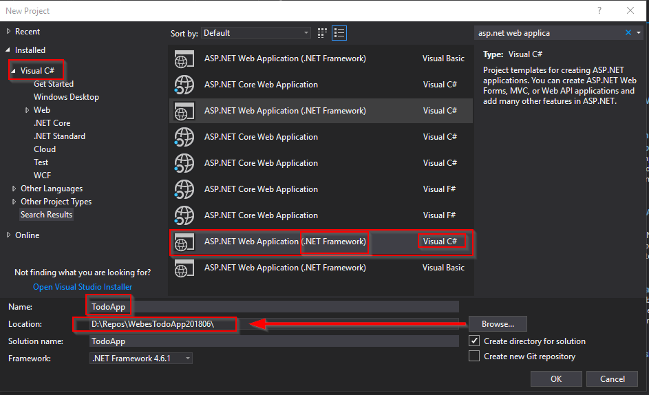
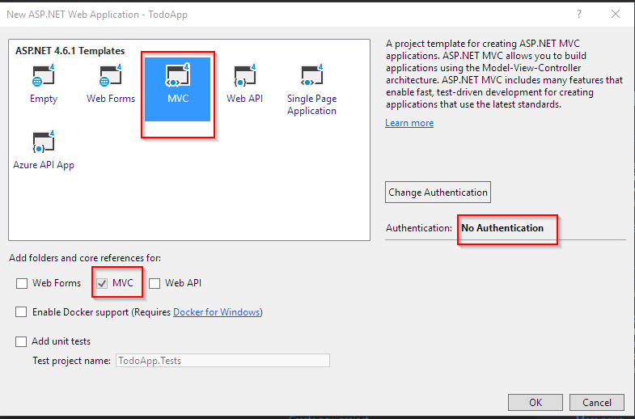
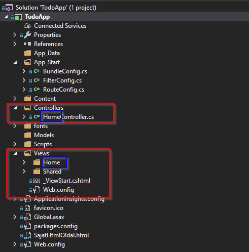
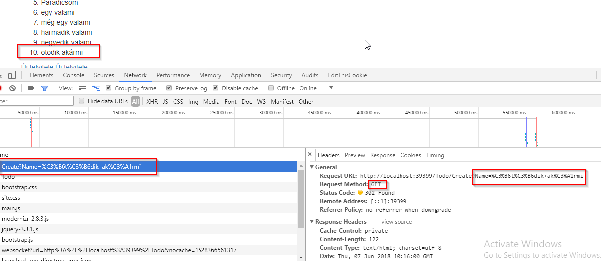

# WebesTodoApp201806
A NetAcademia "Az első webes C# projektem: TO-DO alkalmazás készítése" tanfolyam kiegészítő kódtára

Általános DotNet csoport a facebook-on: [DotNet Cápák](https://www.facebook.com/groups/dotnetcapak/)

## A tanfolyam célja

```
                               +------------------------+
                               |   Desktop számítógép   |
                               |                        |
                               |    +-------------+     |
+---------------+              |    |  Alkalmazás |     |
|               |              |    |             |     |
|  Felhasználó  |              |    +-------------+     |
|               |              |                        |
|               |              |                        |
+---------------+              |                        |
                               +------------------------+


    Hagyományos Desktop/Mobil alkalmazásfejlesztés

```

```
                                                                          +--------------------------+
                                                                          |  Szerver számítógép      |
                               +------------------------+                 |                          |
                               |   Desktop számítógép   |                 |                          |
                               |    Mobil eszköz        |    Hálózati     |                          |
                               |                        |    kapcsolat    | +----------------------+ |
+---------------+              |                        |                 | |                      | |
|               |              |    +-------------+     +---------------> | |  Szerver alkalmazás  | |
|  Felhasználó  |              |    | Alkalmazás  |     |                 | |  (WebSzerveren futó  | |
|               |              |    | (Böngésző)  |     | <---------------+ |  app)                | |
|               |              |    +-------------+     |                 | |                      | |
+---------------+              |                        |        ^        | +----------------------+ |
                               +------------------------+        |        |                          |
                                                                 |        |              ^           |
                                            ^                    |        |              |           |
                                            |                    |        |              |           |
                                            |                    |        |              |           |
                                            |                    |        +--------------------------+
                                            |                    |                       |
                                            +                    +                       +
                                          HTML                 HTTP                     MVC


                                               Webes Alkalmazásfejlesztés

```

## Ajánlott tanfolyamok
- HTML
  [Lenyűgöző weblapok készítése](https://app.netacademia.hu/Tanfolyam/2017htmllanding-lenyugozo-weblapok-keszitese)
- HTTP
  [Hálózati alapismeretek](https://app.netacademia.hu/Tanfolyam/HA-halozati-alapismeretek)
- GIT
  [Fedezzük fel a gitet!](https://app.netacademia.hu/Tanfolyam/git-fedezzuk-fel-a-gitet)


## Az első webes alkalmazásunk létrehozása
Mivel a környezet és a fejlesztési munkafolyamat az ilyen típusú fejlesztéseknél összetett, így nem kézzel hozzuk létre, hanem a Visula Studio template-jének a segítségével.

A varázslóval létrehozzuk az ASP.NET MVC Webalkalmazást (.NET framework), az alábbi módon:

Új projekt létrehozása:


MVC alkalmazás kiválasztása


### Saját html oldal létrehozása és kiszolgálása
Ha létrehozunk egy html állományt az alkalmazás könyvtárában, azt alapértelmezésben az ASP.NET alkalmazásunk szolgáltatja. Vagyis, ha a böngésző elkéri ezt az állományt, akkor a szerver visszaküldi neki:

Ez a kérés (a böngészőből a szerverre):
```
GET http://localhost:39399/SajatHtmlOldal.html
```

(a szerver a böngészűbe) visszaküldi a HTML oldalt (weblap):
```html
<!DOCTYPE html>
<html>
<head>
    <meta charset="utf-8" />
    <title>Ez a saját html oldalunk címe</title>
</head>
<body>
    Ez pedig a saját html oldalunk tartalma, ezt fogja a böngésző megmutatni.
</body>
</html>
```

Ez ugyanúgy működik, ha a file-t nyitjuk meg a böngészőből:
```
file:///D:/Repos/WebesTodoApp201806/TodoApp/TodoApp/SajatHtmlOldal.html
```
akkor is ugyanúgy megjeleníti.

### HTTP: Ha az állomány nem a file rendszerben van, hanem egy másik szerveren

A HTTP feladata: kéréseket megfogalmazását és a válaszok formátumát írja le, ha a hálózaton keresztül szeretnénk egy tartalmat lekérdezni.

A HTTP kérés négy részből áll
- kérés (cím+metódus)
- tartalom
- fejlécek
- végállapot

Ebből minket az első kettő érdekel.

Metódus: pl: GET, POST, PUT, DELETE, stb.
Részletek [a wikipédián](https://hu.wikipedia.org/wiki/HTTP)

Fontos még, hogy a HTTP protokol állapotot nem kezel, így a kérések egymástól teljesen független.

### MVC: Dinamikus weblapokból készített webalkalmazás
Ha nem statikus lapok egymás utánját szeretnénk megjeleníteni, hanem:
- egy jól kinéző formátumot meghatározni az összes oldalra
- saját adatokat metenni a weboldal megfelelő helyére
- az alkalmazás interakcióját megszervezni

Az egy szép feladat, erre szolgál az ASP.NET MVC.

### Konkrét feladat: TODO alkalmazás 0. változat (bevásárlólista)

```
+-----------------+
|                 |
| Bevásárlólista  |
|                 |
+-----------------+
|                 |
| Só              |
|                 |
| Cukor           |
|                 |
| Spagetti        |
|                 |
| Marhahús        |
|                 |
| Paradicsom      |
|                 |
+-----------------+
```

A megjelenítésnél 
- az adatokat kezeljük külön a weboldaltól
- a weboldalunk legyen szép

### MVC alkalmazás főbb elemei



- MVC: Model-View-Controller
  - Controller
    A kérést fogadó objektum, az ő felelőssége 
    - a kérésre a válasz létrehozása, vagy delegálása, 
    - és a válasz visszajuttatása a kérőhöz

Kérdés: hogy jut el a kérés a Controllerhez? Válasz: a kérés címe alapján.

például:

```
GET http://localhost:39399/Home/About
```

itt a cím első fele az alkalmazásra mutat:
```
http://localhost:39399
```

a cím második fele és a metódus pedig az alkalmazáson belül jelent valamit:

```
GET /Home/About
```

Ennek a feldolgozása a **Routing** (útválasztás) feladata. A címben a "/" az elválasztást jelentő jel, vagyis, ennek mentén lehet szétszedni a teljes címet *értelmes*, vagyis az **alkalmazás által feldolgozható** részekre.

Az ASP.NET MVC konvenció szerint, 
    - az **első része** ennek címnek címzi **a controllert** (a példában: Home). Controller: vezérlő
    - a második része pedig azt az **Actiont**, ami kiszolgálja a kérést. Action: függvény

Ennek a segítségével az egyes kéréseket függvényekbe tudjuk szervezni, és a függvényeket pedig vezérlő egységekbe.

Fontos, a címnek a többi része, ami az első kettő egységet (Controller/Action) követi, a kérés paramétereit fogja tartalmazni valamilyen formában.

#### A Vezérlő (Controller)

- Általában az alkalmazás Controllers mappájába tesszük, az áttekinthetőség miatt. Ez nem kötelező, de ajánlott.
- Leszármaztatjuk a Controller osztályból (kötelező) (System.Web.Mvc.Controller, ez való a webalkalmazáshoz, a weblapok generálását végző vezérlőtípus).
- Az osztály neve mindig úgy végződik, hogy Controller, de a routingban ezt nem használjuk, csak a Controller előtti részt.

Az ASP.NET MVC keretrendszer rendkívül erősen épít névkonvencióra: egy-egy elem neve meghatározó szerepet tölt be az alkalmazás működésében.

Két fontos Routing szabály van: 
    - ha az Action nincs megadva, akkor az az **Index**.
    - ha a Controller sincs megadva, akkor az a **Home/Index**

#### A Nézet (View)
Nézkonvenció alapján:

- MVC: Model-View-Controller
  - View
    Olyan nyers HTML állomány, ami képes értelmes HTML szöveget előállítani.
    Saját szabályai vannak (Razor nyelv), ami egy-egy válasz esetén lefut, és generálja a végleges HTML-t

Általában
A Controllerhez tartozó nézetek a webalkalmazásunk \Views mappájában vannak, Controllerenként csoportosítva, a csoportosító mappa neve ugyanaz, mint a Controller Routing neve.

Például: a HomeController nézetei a Views\Home mappában vannak.

És: az egyes nézet állományok neve azonos a Controller Action nevével, amihez tartoznak.

Megjegyzés: ezt a konvenciót megtörhetjük: ki is jelölhetünk egy Action-höz egy meghatározott View-t.

Vagyis, a HomeController.TodoList() action-höz automatikusan tartozó nézet itt van: \Views\Home\TodoList.cshtml

A HTML kód írásához [ezt a tutorialt](https://www.w3schools.com/Html) használhatjuk.

A nézet képes definiálni az adatmodell típusát, amin dolgozik.

- MVC: Model-View-Controller
  - Model
    Az adatokat tartalmazó objektum, ami a Controller és a View között az adatokat szállítja

#### Házi feladat
- GitHub repo (regisztráció és saját kódtár készítése)
- Saját projekt segítségével ismerkedni a HTML-lel, az MVC-vel és a GitHub-bal

## Az alkalmazásból CRUD alkalmazás készítése a Todo elemekre
CRUD: **C**reate, **R**ead, **U**pdate, **D**elete kifejezések rövidítése

Egy rövid képernyő skicc, specifikáció gyanánt:

```
+------------------------------------------------+
|                                                |
|  +------------------+---------+--------+       |
|  | elem 1           | módosít | töröl  |       |
|  +-------------------------------------+       |
|  | elem 2           | módosít | töröl  |       |
|  +-------------------------------------+       |
|  | elem 3           | módosít | töröl  | <-----------------------------+--+  Műveletek kezdeményezésére
|  +------------------+---------+--------+       |                       |     szolgáló elemek, amivel
|  |                                     |       |                       |     a felhasználó kezdeményezni
|  +-------------------------------------+       |                       |     tudja az adott műveletet
|  |                                     |       |                       |     (link, gomb, stb.)
|  +-------------------------------------+       |                       |
|  |                                     |       |                       |
|  +-------------------------------------+       |                       |
|  |                                     |       |                       |
|  +-------------------------------------+       |                       |
|                                                |                       |
|                                                |                       |
|                                                |                       |
|  +-----------------+   +----------+            |                       v
|  | beviteli mező   |   | rögzítés | <---------------------------------+
|  +-----------------+   +----------+            |
|                                                |
|                                                |
+------------------------------------------------+
```

A Controller áttekintő nézetét szolgáltató kérés az Index, innen is kapta a nevét. Vagyis, a mi kezdeti áttekintő nézetünk, az Index action-re kell, hogy kerüljön. Ebből következik, hogy átnevezzük a jelenlegit.

### Feladatok
- indexre beviteli mező tétele és a bevitel programozása (majd, de előbb)
  - [X] beviteli oldal létrehozása
        Ahhoz, hogy adatot küldjünk a böngészőből a szerver felé, kell
        - kell egy űrlap `<form></form>` erre
          - kell egy `<input />` aminek van neve (`<input name="valami megnevezés"/>`)
          - kell egy gomb (vagy `<input type="submit" />` vagy `<button></button>`)
        Ha ez mind megvan, akkor a böngésző a beviteli mező tartalmát beteszi a hívás paraméterei közé, így:
        `http://localhost:39399/Todo/Create?Tennival%C3%B3=agaadfgafgadf `



       Folyamat: 
            1. /Todo/Create paraméter nélkül feladja a Create nézetet
            2. /Todo/Create paraméterrel rögzíti az adatot és átirányít az Index-re

        Sajnos az adatok mindig inicializálódnak, azt még meg kell oldani.

        De a legnagyobb elvi baj ezzel, hogy az adatok felküldése GET metódust használ, ami (mivel adatmódosítás történik) nem szabványos.
        Helyette POST kell.

  - [X] beviteli oldal elérhetővé tétele az index oldalon (link formájában: http://localhost:39399/Todo/Create)
        linkek esetén használható relatív cím fogalma: /Todo/Create
        vagy használhatjuk a beépített megoldást: ActionLink

  - [X] Tesztadatok, amik kérések között is megmaradnak
  - [X] Adatbevitel programozása POST segítségével
        Post esetén az adatok Form paraméterként érkeznek:


    
        Amit a Model Binder segítségével ugyanúgy függvény paraméterként tudunk átvenni az Action definícióban:

```
                                                           GET: URL paraméter        Model binding:név alapján egyeztet
+----------------------------------------------+           (Query string)              +-----+
|    Böngésző                                  |         ^ +--------------->           |     |
+----------------------------------------------+         |                             |     |           Alkalmazás
|                                              |         |                             |     |         +--------------+
|                                              |         |                             |     |         |              |
|              +------------------+            |         |                             |     |         |              |
|              | Adat1=érték1     |            | +------->                             |     | Adatok  |              |
|              |                  |            |                                       |     | +-----> |              |
|              +------------------+            |                                       |     |         |              |
|              | Adat2=érték2     |            | +------->                             |     |         |              |
|              |                  |            |         |                             |     |         |              |
|              +------------------+            |         |                             |     |         |              |
|                                              |         |                             |     |         |              |
|                                              |         |                             |     |         +--------------+
|                                              |         |                             |     |
|                                              |         | POST: Form data             |     |
|                                              |         v------------------------->   |     |
|                                              |                                       |     |
|                                              |                                       |     |
|                                              |                                       +-----+
|                                              |
|                                              |
|                                              |
|                                              |
|                                              |
|                                              |
|                                              |
|                                              |
+----------------------------------------------+
```

  - [X] valahogy az irányokat szét kéne választani az adatok/nézet kiszolgálásakor. Vagyis 
     - [X] lenne egy olyan függvény, ami kiszolgálja a Create navigációt és feladja az űrlapot (GET Todo/Create)
           [HttpGet] attributummal megoldható, hogy egy Action csak GET kéréseket szolgáljon ki.
     - [X] lenne egy olyan függvény, ami pedig fogadná az adatokat (POST Todo/Create)
           [HttpPost] attributummal pedig megoldható, hogy egy Action csak POST kéréseket szolgáljon ki.
     Ha nincs attributum szűrő akkor alapértelmezésben a routing csak név alapján választ, minden metódust ugyanaz az egy Action-t minden kérés esetén .
     a függvény szignatúrája: a függvény neve és a parméterlistája (típusok listája sorrenben, pl: Create(string, string, int)). A szignatúrához nem tartozik a visszatérési érték.
     Ugyanaz a függvénynév különböző szignatúrával különböző függvénynek számít, így létrehozható.
    Ez egy C# alaptulajdonság (function overloading).

  - [ ] indexre beviteli mező tétele és a bevitel programozása
 
### Házi feladat
- saját beviteli oldal próbálgatása
- előre gondolkodás: hogy lehet megoldani a törlést és a módosítást?


### Feladatok
- [ ] Saját módosítás (Edit) űrlap készítése
  - [X] nézet készítése
  - [X] GET action készítése
        Mivel létező adatot módosítunk, így azonosítanunk kell a megfelelő tételt, így:
       - [ ] vagy név alapján keresem meg a tételt
       - [X] vagy készítek egy "megtalálási" módszert.
             Minden listaelemnek azonosíthatónak kell lennie. Vagyis minden tételen van egy olyan adat, ami csak azon a tételen van, máshol nem szerepel. Ezt hívjuk egyedi azonosítónak. Erre van szükség a módosításhoz. Ez legyen szám, ami sorszám.
             **Figyelem:** az azonosítót a létrehozáskor is ki kell tölteni!
  - [X] POST action készítése (a PUT ismételhető módosítást jelent: 1-szer, 2-szer, ... 10-szer végrehajtva ugyanazt az eredményt adja)
        Sajnos a HTTP használ PUT-ot, de a html form az nem, így csak GET és POST között tudunk választani. Vagyis, ez az Action a POST-ot fogja kapni.
- [X] Saját törlés (Delete) űrlap készítése
  - [X] nézet készítése
  - [X] GET action készítése
  - [X] DELETE action helyett POST action készítése
- [X] Saját megtekintés (Details) űrlap készítése
  - [X] nézet készítése
  - [X] GET action készítése
- [X] Ezek elérésének a megoldása az Index oldalról


## Adatbáziskezelés
Microsoft SQL Szervert telepítünk [chocolatey](https://chocolatey.org/) segítségével, ezeket a csomagokat telepítjük:

- [Microsoft SQL Server Express](https://chocolatey.org/packages/sql-server-express)
  ```
  cinst sql-server-express
  ```
- [SQL Server Management Studio](https://chocolatey.org/packages/sql-server-management-studio): 
  ```
  cinst sql-server-management-studio
  ```

A [chocolatey telepítéshez](https://chocolatey.org/install) pedig ezt a parancsot kell futtatni adminisztrátori parancssorból:
```
@"%SystemRoot%\System32\WindowsPowerShell\v1.0\powershell.exe" -NoProfile -InputFormat None -ExecutionPolicy Bypass -Command "iex ((New-Object System.Net.WebClient).DownloadString('https://chocolatey.org/install.ps1'))" && SET "PATH=%PATH%;%ALLUSERSPROFILE%\chocolatey\bin"
```

Az adatbázis létrehozásához:
- [EntityFramework nuget csomag](https://www.nuget.org/packages/EntityFramework/) telepítése
- Db.cs osztály létrehozása
- leszármaztatás a DbContext-ből
- egy DbSet<> típusú property létrehozása (ez egy adattáblát fog létrehozni az adatbázisban)
- minden adattáblának kell, hogy legyen egyedi azonosítója (Key)

### Házi feladat
- hibalehetőségek vizsgálata a Single esetén
  - 'Sequence contains more than one element': ha több elemre is igaz a szűrőfeltétel, pl:
    ```csharp
    var item = db.TodoItems.FirstOrDefault(x => x.Name.Contains("a"));
    if (item == null)
    { // ha nincs ilyen elem

    }
    else
    { // ha megvan

    }
    ```
  - 'Sequence contains no elements': nincs olyan elem a listában, amire keresünk
    ```csharp
    var item = db.TodoItems.SingleOrDefault(x => x.Id == id);
    if (item == null)
    { // ha nincs ilyen elem

    }
    else
    { // ha megvan

    }
    ```
  


- megtalálni a különbséget az 
  - `<input id="isDone" name="isDone" type="checkbox" value="true" >`
  - és a @Html.CheckBox("isDone")
    között.

Utóbbi ilyet generál:

```
<input name="isDone" id="isDone" type="checkbox" value="true">
<input name="isDone" type="hidden" value="false">
```

Ez úgy működik, hogy a checkbox csak akkor jön fel a FormData-val, ha *be van pipálva*. 
Ha nincs, akkor egyszerűen a **böngésző nem küldi fel**. Ebben az esetben, (ha nincs pipa)
a rejtett mező jön a böngészőből, ami `false` értékű, pont, mintha nem lenne a checkbox 
kipipálva.
Ha pedig ott a pipa, akkor **mindkét érték feljön**, egy `true` és egy `false`, és a **Modelbinder**
a sorrendjük alapján választja az elsőt, ami a `true`.

### Entity Framework Code First

```
+--------------------------------+    +---------------------------------+          +----------------------------------+
|                                |    |                                 |          |                                  |
|                                |    |     EntityFramework             |          |                                  |
|        Alkalmazás              |    |     Code First                  |          |      Adatbázis                   |
|                                |    |                                 |          |                                  |
|                                |    |                                 |          |  +---------------+               |
|                                |    |     1. A kód alapján kitalálja  |          |  |  TodoItems    |               |
|                                |    |        hogy hogy lenne jó       |          |  |               |               |
|           Adatok osztályba     |    |   +->  adatbázisba írni az  +-> | +------> |  |  TodoItem     |               |
|           szervezve            |    |   |    adatokat                 |          |  |  TodoItem     |               |
|           (TodoItem)           |    |   |                             |          |  |  TodoItem     |               |
|                                |    |   |                             |          |  |  ...          |               |
|                         +--->  | +> | +->                             |          |  |               |               |
|                         +      |    |                                 |          |  |               |               |
|           Adatelérési osztály  |    |                                 |  <-----------------+        |               |
|           (DbContext)          |    |     2. Ha pedig adatot akarok   |  |       |  |      ^        |               |
|           DbSet<TodoItem>      |    |        lekérdezni, akkor a Linq |  v       |  |      |        |               |
|              TodoItems   <-----------------+ felületen keresztül      | <+       |  +---------------+               |
|                                |    |        fogadja a kérést és      |          |         ^                        |
|                                |    |        SQL lekérdezéssé alakítja|          |         +                        |
|   db.TodoItems.Single() +---------------->   a visszakapott adatokat  | +-------------> SELECT                      |
|                                |    |        pedig betölti a TodoItems|          |        Id, Name, Done            |
|                                |    |        DbSet-be                 |          |      WHERE                       |
|                                |    |                                 |          |        Id == @id                 |
|                                |    |                                 |          |                                  |
+--------------------------------+    +---------------------------------+          +----------------------------------+
```

### Stílusok és stíluslapok
[HTML és CSS gyártás kézzel ingyenes tanfolyam](https://app.netacademia.hu/Tanfolyam/2017htmllanding-lenyugozo-weblapok-keszitese)

#### Saját stílusok

- stílusok használata
  A HTML leírónyelv minden HTML taghez enged `style` paramétert megadni. Ebben színezésre méretre, formázásra, elhelyezkedére vonatkozó beállításokat lehet megadni. Bővebben a [w3schools](https://www.w3schools.com/html/html_styles.asp) oldalán érdemes nézelődni.

- egységes stílusokat használjunk
  Erre szolgál a CSS: a stílusokat elválasztjuk a html kódtól, a html a tartalom, a CSS a forma definíciója.
  Részletesen [ezen az oldalon](https://www.w3schools.com/css/default.asp) lehet utánanézni.

  A CSS beállításokat a böngészőkben a Developer Tools (F12) előhívásával vizsgálhatjuk.

#### Bootstrap
A Twitter egyik grafikusa és egyik programozója munkájából kialakult webes csomag, ami képes az adott weboldal reszponzív (különböző méretekhez automatikusan igazodó) megjelenítésére.
A csomag [innen](https://getbootstrap.com/) elérhető, a forráskódja a [githubon](https://github.com/twbs/bootstrap) van.

A Bootstrap egyik alapja a [Grid rendszer](https://getbootstrap.com/docs/4.1/layout/grid/).

A másik elve pedig az, hogy különböző megjelenítési elemeket lehetőleg a `class` paraméter megadásával létre lehessen hozni, egyéb css és javascript ismeretek nélkül. [Az egyes komponensek listája](https://getbootstrap.com/docs/4.1/components/alerts/).

#### Az ASP.NET Html generáló felépítése

A html oldal generálásának lépései:
1. ~\Views\_ViewStart.cshtml (itt általában a Layout-ot állítjuk be)
2. A folytatás a megadott Layout-tól függ, layout oldalakból több is lehet. Le is tilthatom: 
   ```csharp
   @{
       Layout = null;
   }
   ```
3. A Layout olda tartalmazza a html vázat. (pl: ~\Views\Shared\_Layout.cshtml)
4. itt a html generáláson kívül eldől, hogy milyen css és milyen javascript állományokat tölt be az oldal.
  - a css-t a `<head></head>` részben kell betölteni, a javascripteket pedig a `<body></body>` rész végén szoktuk.
  - ezeket az állományokat csomagokba szervezzük (bundle) és így hivatkozunk rájuk.
    ```
    @Styles.Render("~/Content/css")
    @Scripts.Render("~/bundles/modernizr")
    ``` 
5.  a html vázban kihagy két helyet:
    - a `@RenderBody()` sor jelzi azt a részt, ahova az Action által meghatározott nézet kerül.
    - a script kódokat a `<body></body>` végére tesszük, ennek a helyét hagyja ki a 
      ```csharp
      @RenderSection("scripts", required: false)
      ```
      sor

    a végére pedig a javascriptek betöltése kerül a saját bundle-ból:
    ```
    @Scripts.Render("~/bundles/jquery")
    @Scripts.Render("~/bundles/bootstrap")
    ```

Egy kérés kiszolgálása tehát:
A Action kijelöli a View-t, az kijelöli a Layout-ot, generáljuk a View alapján a html kód tartalmi részét, generáljuk a Layout kód alapján a html oldalt, és a View által generált htmlt beszúlruk a teljes oldal megfelelő helyére.


### Mit lehet kihozni egy varázslóból
- Ha EntityFramework-ot használunk, és jól állítottuk elő az adatmodellt, akkor a Visual Studio controller varázslójával teljesen helyes Bootstrap nézeteket és hozzájuk tartozó varázslót lehet generálni két kattintással.

### Házi Feladat
- hozzatok létre új adat osztályt
- kössétek be a Db.cs-be
- hozzatok létre hozzá kézzel vezérlőt és nézeteket a CRUD-hez
- hozzatok létre varázslóval vezérlőt és nézeteket
- hasonlítsátok össze a kódot, és indokoljátok a különbséget.
- Például a nyilvántartásba felvehettek 
  - autókat (szín, rendszám, típus, stb.)
  - számítógépeket